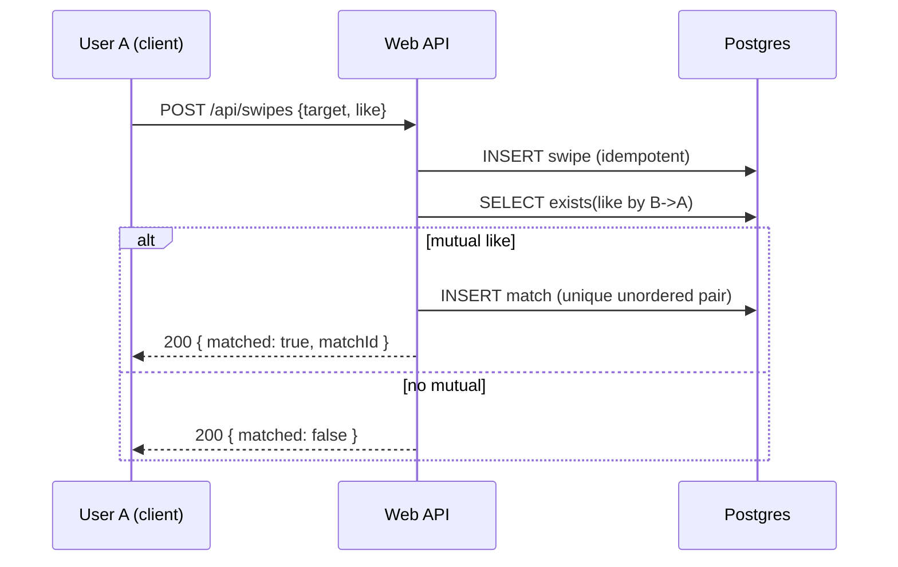
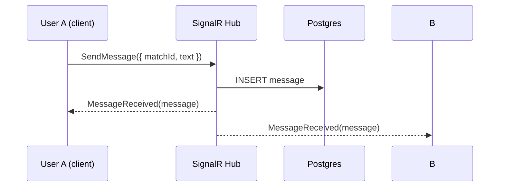
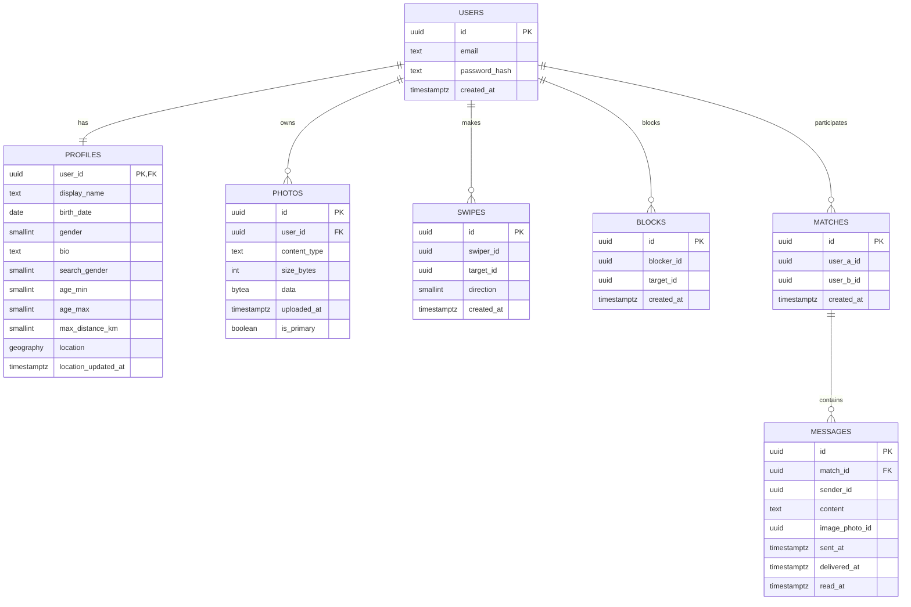

# requirements.md — Tinder‑MVP (Expo + ASP.NET Core + PostgreSQL + SignalR)

## 0) Summary

A minimum viable Tinder-like app with authentication, user profiles & photos, a candidate feed with swipe gestures, matches, and a real-time chat. Frontend — **Expo (React Native, TypeScript)**. Backend — **ASP.NET Core Web API (.NET 8+)** with **EF Core + Npgsql + PostGIS**, **ASP.NET Identity + JWT**, chat via **SignalR**. Everything runs via **Docker Compose** (API, DB, Frontend; optional pgAdmin/Redis).

---

## 1) Goals & Scope

- **MVP Goals**
  - Registration/login (email + password), JWT + refresh tokens
  - User profile, photo upload (store photos in DB)
  - Update location and fetch candidates by radius
  - Swipes (like/pass), create a match on mutual like
  - Real-time chat (SignalR) between matched users, typing indicator, delivered/read markers
- **Out of scope (for now)**
  - Push notifications, paid features, social logins, premium matching algorithms, ML moderation, Stories, etc.

---

## 2) Deliverables

- **A working Docker Compose** for local development (all services)
- **Backend**: ASP.NET Core Web API (Controllers), EF Core migrations, Swagger, HealthChecks
- **Frontend**: Expo (web mode in container for dev), base screens and navigation
- **Database**: PostgreSQL 16 with PostGIS, schema/indexes, development seed data
- **Docs**: this `requirements.md`, auto-generated Swagger/OpenAPI
- **Minimal tests**: API smoke checks (health, auth flow)

---

## 3) Tech Stack & Versions

- **Backend**
  - .NET **8.0** (LTS) — .NET 9/10 allowed, default is 8.0
  - ASP.NET Core Web API (Controllers)
  - EF Core 8 + `Npgsql.EntityFrameworkCore.PostgreSQL` + `NetTopologySuite` (geo)
  - ASP.NET Identity, JWT (Access 15 min, Refresh 14 days)
  - SignalR (`Microsoft.AspNetCore.SignalR`)
  - Swagger (`Swashbuckle.AspNetCore`)
  - Rate Limiting (`Microsoft.AspNetCore.RateLimiting`)
  - Serilog (console) + HealthChecks
- **Database**
  - PostgreSQL **16** + **PostGIS 3.x** (`postgis/postgis:16-3.4`)
- **Frontend**
  - Expo SDK (Node 20), React Native, TypeScript
  - React Navigation, Zustand/Redux Toolkit (choose one), Axios, `@microsoft/signalr`
  - `react-native-gesture-handler` / `react-native-reanimated` (for swipes)
  - `expo-image-picker` (native; on web use `<input type="file">`)
- **DevOps**
  - Docker / Docker Compose
  - Optional: pgAdmin, Redis (SignalR backplane later)

---

## 4) Project Structure

```
.
├── requirements.md
├── docker-compose.yml
├── backend/
│   ├── App/                 # ASP.NET Core Web API (single project)
│   │   ├── App.csproj
│   │   ├── Program.cs
│   │   ├── appsettings.json
│   │   ├── Controllers/
│   │   ├── Hubs/
│   │   ├── Data/            # DbContext, migrations
│   │   ├── Domain/          # Entities, enums
│   │   ├── Services/        # Auth, Swipes, Matches, Photos
│   │   ├── DTOs/            # request/response models
│   │   ├── Config/
│   │   └── Middleware/
│   └── Dockerfile
├── frontend/
│   ├── app.json
│   ├── package.json
│   ├── tsconfig.json
│   ├── Dockerfile
│   └── src/
│       ├── App.tsx
│       ├── screens/
│       ├── components/
│       ├── store/
│       ├── api/
│       └── navigation/
└── .env.example
```

---

## 5) Docker Compose — Required Manifest

Services and settings that **must** be present in `docker-compose.yml`:

- **db** (`postgis/postgis:16-3.4`)
  - `POSTGRES_DB=appdb`, `POSTGRES_USER=appuser`, `POSTGRES_PASSWORD=appsecret`
  - Port `5432:5432`
  - Volume `pgdata:/var/lib/postgresql/data`
  - `healthcheck: pg_isready`
- **api** (build `./backend`, `Dockerfile`)
  - `ASPNETCORE_URLS=http://+:8080`
  - `ConnectionStrings__Default=Host=db;Port=5432;Database=appdb;Username=appuser;Password=appsecret`
  - `Jwt__Issuer=tinder-mvp`, `Jwt__Audience=tinder-mvp`, `Jwt__Key=<dev-secret>`
  - `Photos__MaxBytes=5242880` (5 MB)
  - `Cors__AllowedOrigins__0=http://localhost:19006`
  - Port `8080:8080`
  - Depends on `db` (health)
- **frontend** (build `./frontend`, `Dockerfile`)
  - `EXPO_PUBLIC_API_BASE_URL=http://localhost:8080`
  - Ports: `19006:19006` (Expo Web), `19000:19000`, `19001:19001`
  - Mount `./frontend:/app`
  - Depends on `api`
- **pgadmin** (optional, profile `tools`)
  - Port `5050:80`
- **redis** (optional, profile `scale`) — for SignalR backplane (later)

---

## 6) Environment Variables (`.env.example`)

```
POSTGRES_DB=appdb
POSTGRES_USER=appuser
POSTGRES_PASSWORD=appsecret

ASPNETCORE_ENVIRONMENT=Development
ASPNETCORE_URLS=http://+:8080

ConnectionStrings__Default=Host=db;Port=5432;Database=appdb;Username=appuser;Password=appsecret

Jwt__Issuer=tinder-mvp
Jwt__Audience=tinder-mvp
Jwt__Key=change-this-dev-secret-please
Jwt__AccessMinutes=15
Jwt__RefreshDays=14

Photos__MaxBytes=5242880

Cors__AllowedOrigins__0=http://localhost:19006

EXPO_PUBLIC_API_BASE_URL=http://localhost:8080
```

---

## 7) Database & Data Requirements

### 7.1 PostGIS Extension
Run during migration:
```sql
CREATE EXTENSION IF NOT EXISTS postgis;
```

### 7.2 Minimum Schema

- **users** (ASP.NET Identity):
  - `id uuid PK`, `email unique`, `password_hash`, `created_at timestamptz`
- **profiles** (1:1 with users):
  - `user_id uuid PK/FK -> users(id)`
  - `display_name text not null`
  - `birth_date date not null`
  - `gender smallint not null`  *(0=unknown,1=male,2=female,3=nonbinary)*
  - `bio text null`
  - `search_gender smallint not null` *(simple enum for MVP)*
  - `age_min smallint not null default 18`
  - `age_max smallint not null default 100`
  - `max_distance_km smallint not null default 50`
  - `location geography(Point,4326) null`
  - `location_updated_at timestamptz null`
  - Index: `GIST(location)`
- **photos**:
  - `id uuid PK`
  - `user_id uuid not null FK -> users(id)`
  - `content_type text not null` *(image/jpeg|png|webp)*
  - `size_bytes int not null check(size_bytes<=5_242_880)`
  - `data bytea not null`
  - `uploaded_at timestamptz not null default now()`
  - `is_primary boolean not null default false`
- **swipes**:
  - `id uuid PK`
  - `swiper_id uuid not null`
  - `target_id uuid not null`
  - `direction smallint not null` *(0=pass,1=like)*
  - `created_at timestamptz not null default now()`
  - Unique key: `(swiper_id, target_id)`
  - Index: `btree(swiper_id)`, `btree(target_id)`
- **matches**:
  - `id uuid PK`
  - `user_a_id uuid not null`
  - `user_b_id uuid not null`
  - `created_at timestamptz not null default now()`
  - Unordered uniqueness: `least(user_a_id,user_b_id), greatest(user_a_id,user_b_id)`
- **messages**:
  - `id uuid PK`
  - `match_id uuid not null FK -> matches(id)`
  - `sender_id uuid not null`
  - `content text null`
  - `image_photo_id uuid null FK -> photos(id)`
  - `sent_at timestamptz not null default now()`
  - `delivered_at timestamptz null`
  - `read_at timestamptz null`
  - Index: `btree(match_id, sent_at)`
- **blocks**:
  - `id uuid PK`
  - `blocker_id uuid not null`
  - `target_id uuid not null`
  - `created_at timestamptz not null default now()`
  - Uniqueness: `(blocker_id, target_id)`
- **refresh_tokens**:
  - `id uuid PK`
  - `user_id uuid not null`
  - `token text unique not null`
  - `expires_at timestamptz not null`
  - `revoked_at timestamptz null`

### 7.3 Geo Candidate Query
- Candidates are selected by distance:
```sql
ST_DWithin(p.location, u.location, radius_meters)
```
- Filter by age using `birth_date`.
- Exclude: self, blocked users, already swiped users.

---

## 8) Backend — Implementation Requirements

- **ASP.NET Core (.NET 8)**, Controllers + Attribute Routing.
- **EF Core**: `Npgsql` + `NetTopologySuite` (for `Point` with SRID 4326).
  - In `DbContext`:
    ```csharp
    options.UseNpgsql(conn, x => x.UseNetTopologySuite());
    ```
- **Identity + JWT**:
  - Passwords hashed via Identity (PBKDF2).
  - AccessToken: 15 min; RefreshToken: 14 days (env-configurable).
  - Refresh token rotation; store in `refresh_tokens`.
- **SignalR**:
  - Hub at `/hubs/chat`
  - Authorize via Bearer JWT (`AddAuthentication().AddJwtBearer(... OnMessageReceived for accessToken in query)`).
  - Use SignalR groups keyed by `matchId`.
- **Security**:
  - CORS: allowlist from env.
  - Rate Limiting: baseline 100 req/min/IP for sensitive endpoints (`auth`, `photos`, `messages`).
  - Upload validation: MIME sniffing, size limit, strip EXIF.
- **Migrations**:
  - Call `Database.Migrate()` on startup.
  - First migration must create PostGIS (`CREATE EXTENSION`).
- **Observability**:
  - Serilog (Console), ASP.NET Health Checks at `/healthz` (DB OK => 200).
- **Swagger**:
  - `/swagger` enabled in Development.

---

## 9) API Contracts (MVP)

### General
- **Base URL**: `/api`
- **Auth**: `Authorization: Bearer <access_token>`
- **Paging**: `page` (1..), `pageSize` (default 20, max 50)
- **Error model**:
  ```json
  { "error": "string", "details": "string|null", "traceId": "string" }
  ```

### 9.1 Auth
- `POST /api/auth/register`
  - **Request**:
    ```json
    { "email":"a@b.com", "password":"P@ssw0rd!", "displayName":"Alex", "birthDate":"1995-04-12", "gender":2 }
    ```
  - **201**: empty or `{ "userId":"uuid" }`
  - **400**: validation, email already in use
- `POST /api/auth/login`
  - **Request**: `{ "email":"", "password":"" }`
  - **200**:
    ```json
    {
      "accessToken":"...", "accessExpiresAt":"2025-01-01T10:00:00Z",
      "refreshToken":"...", "refreshExpiresAt":"2025-01-15T10:00:00Z"
    }
    ```
  - **401**: invalid credentials
- `POST /api/auth/refresh`
  - **Request**: `{ "refreshToken":"..." }`
  - **200**: same as login
  - **401/403**: expired/revoked
- `POST /api/auth/logout`
  - Invalidate refresh token. **204**

### 9.2 Me/Profile/Photos/Location
- `GET /api/me` → current user profile
- `PUT /api/me`
  - **Request** (partial/full update):
    ```json
    {
      "displayName":"Alex", "bio":"Hi!",
      "searchGender":2, "ageMin":22, "ageMax":35, "maxDistanceKm":30
    }
    ```
  - **200**: updated profile
- `PUT /api/me/location`
  - **Request**: `{ "lat":50.4501, "lng":30.5234 }`
  - **204**
- `POST /api/me/photos` (multipart/form-data: `file`)
  - **201**: `{ "photoId":"uuid", "isPrimary":false }`
- `DELETE /api/me/photos/{photoId}` → **204**
- `GET /api/users/{id}` → public profile card (non-sensitive fields only)

- `GET /api/users/{id}/photos/{photoId}`
  - Returns binary content with `Content-Type` from DB, with `Cache-Control: public,max-age=86400`.

### 9.3 Feed/Swipes/Matches
- `GET /api/feed?radiusKm=30&page=1&pageSize=20`
  - Candidate cards (id, name, age, primary photo url, distance in km (rounded)).
- `POST /api/swipes`
  - **Request**: `{ "targetUserId":"uuid", "direction":"like"|"pass" }`
  - **200**:
    ```json
    { "matched": false }
    ```
    or when mutual like:
    ```json
    { "matched": true, "matchId":"uuid" }
    ```
  - Idempotency: repeating the same swipe → 200 with current state.
- `GET /api/matches?page=1&pageSize=50`
  - List of matches (id, counterpart, last message preview, unread count).
- `GET /api/matches/{matchId}` → details (both participants)

### 9.4 Messages/Chat
- **SignalR Hub**: `/hubs/chat`
  - Client→Server:
    - `JoinMatch(matchId: string)`
    - `SendMessage({ matchId: string, text?: string, photoId?: string })`
    - `Typing({ matchId: string, isTyping: boolean })`
    - `MarkRead({ matchId: string, messageIds: string[] })`
  - Server→Client:
    - `MessageReceived(message)`
    - `Typing({ matchId, userId, isTyping })`
    - `ReadReceipt({ matchId, messageIds, at })`
- **REST fallback**:
  - `GET /api/matches/{matchId}/messages?before=2025-09-01T00:00:00Z&take=30`
  - `POST /api/matches/{matchId}/messages` — offline send (same contract)

---

## 10) Business Rules & Validation

- **Age**: 18+ (by `birth_date`)
- **Photos**: JPEG/PNG/WebP, ≤ 5 MB, MIME signature check
- **Location**: required to appear in others' feeds; without location — user is hidden and sees an empty feed
- **Swipes**: a single record per pair `(swiper,target)`; changing mind is not supported in MVP
- **Match**: one record per unordered user pair
- **Chat**: only match participants can send/read messages
- **Blocks**: if blocked — exclude from feed/matches/chat

---

## 11) Frontend — Required Screens & Behavior

- **AuthStack**
  - Sign In, Sign Up, (optional) Forgot
- **MainTabs**
  - **Feed**: cards with swipe gestures (left=pass, right=like), buttons mirroring gestures
  - **Matches**: list of matches
  - **Chat**: conversation screen (by matchId), typing indicator, auto-scroll
  - **Profile**: edit profile, upload/delete photos, update location
- **State**
  - Store `accessToken`/`refreshToken` (SecureStore on device; on web — in-memory + silent refresh)
  - Global store (Zustand/Redux)
- **API client**
  - Axios base URL from `EXPO_PUBLIC_API_BASE_URL`
  - Interceptor for refresh flow (on 401 if refresh still valid)
- **SignalR**
  - Connect to `/hubs/chat` with `accessTokenFactory`
  - Auto reconnect, subscribe to `matchId` groups

---

## 12) Non-Functional Requirements

- **Performance**: single API instance (dev), typical responses ≤ 300 ms
- **Reliability**: DB migrations on startup; swipe→match in a transaction
- **Security**:
  - Rate limit: 100 req/min/IP on `auth`, `photos`, `messages`
  - CORS allowlist
  - Logs with no PII
- **Scalability (later)**: Redis backplane for SignalR, move photos to object storage (S3/MinIO), CDN
- **Locale/time**: store all timestamps in UTC

---

## 13) Sequences (Diagrams)

### 13.1 Swipe → Match


### 13.2 Chat Message


---

## 14) Candidate Feed Algorithm (MVP)

1. User must have a recent location.
2. Select users within `min(my.max_distance_km, query.radiusKm)` of my point using `ST_DWithin`.
3. Filter by age and gender preferences.
4. Exclude: myself, already swiped, blocked users.
5. Sort: by `location_updated_at DESC`, then `created_at DESC`.
6. Pagination: `page/pageSize`.

---

## 15) Seed Data (dev)

- Create 5–10 test users with diverse gender/age/locations.
- 1–2 photos per user (small, <200 KB).
- Pre-seed 2–3 mutual matches and 3–5 messages each.

---

## 16) Test Cases (Definition of Done)

- **Auth**
  - Register → 201; Login → 200 with tokens; Refresh → 200; Logout → 204
- **Profile**
  - Update profile/settings → 200; update location → 204
- **Photos**
  - Upload JPEG/PNG/WebP ≤ 5 MB → 201
  - Photo URL returns binary with correct `Content-Type`
- **Feed**
  - Without location → empty list + message
  - With location → nearby candidates, no previously swiped users
- **Swipes/Matches**
  - `like` without mutual → `{matched:false}`
  - Mutual `like` → single `match` record created
  - Repeating same `like/pass` → 200, no side effects
- **Chat**
  - Match participants receive real-time messages
  - Read receipts update
- **Health**
  - `/healthz` → 200 when DB healthy
- **Swagger**
  - `/swagger` available and lists all endpoints

---

## 17) Files to Generate

### 17.1 `docker-compose.yml`
- Must include services `db`, `api`, `frontend` (and profiles `tools: pgadmin`, `scale: redis`)
- Healthchecks, env vars as in section 5

### 17.2 Backend (`/backend`)
- **Dockerfile** for SDK→runtime publish (ASP.NET 8)
- **App.csproj** with packages:
  - `Microsoft.AspNetCore.Identity.EntityFrameworkCore`
  - `Microsoft.EntityFrameworkCore` + `Microsoft.EntityFrameworkCore.Design`
  - `Npgsql.EntityFrameworkCore.PostgreSQL` + `Npgsql.EntityFrameworkCore.PostgreSQL.NetTopologySuite`
  - `Swashbuckle.AspNetCore`
  - `Microsoft.AspNetCore.SignalR`
  - `Serilog.AspNetCore`, `Serilog.Sinks.Console`
  - `Microsoft.AspNetCore.RateLimiting`
- **Program.cs**:
  - Identity + JWT auth
  - DbContext (UseNpgsql + UseNetTopologySuite)
  - SignalR at `/hubs/chat`
  - CORS, RateLimit, Swagger, HealthChecks
  - `Database.Migrate()` on startup
- **DbContext & migrations**: all tables (section 7.2), `CREATE EXTENSION postgis`
- **Controllers**:
  - `AuthController`, `MeController`, `PhotosController`, `FeedController`, `SwipesController`, `MatchesController`, `MessagesController` (REST fallback)
- **Hubs**:
  - `ChatHub` with methods from section 9.4
- **Services**:
  - `AuthService`, `ProfileService`, `PhotoService`, `FeedService`, `SwipeService`, `MatchService`, `MessageService`
- **DTOs**: requests/responses for contracts (section 9)
- **Middleware**: global error handler → error model from section 9
- **Config**: Options for Jwt, Photos, CORS

### 17.3 Frontend (`/frontend`)
- **Dockerfile** (Node 20-alpine, `expo start --web --non-interactive`)
- **package.json** deps:
  - `expo`, `react`, `react-native`, `typescript`
  - `@react-navigation/native`, `@react-navigation/native-stack`
  - `axios`, `zustand` (or `@reduxjs/toolkit` + `react-redux`)
  - `@microsoft/signalr`
  - `react-native-gesture-handler`, `react-native-reanimated`
  - `expo-image-picker`
- **app.json**, **tsconfig.json**
- **src/**:
  - `api/http.ts` (axios + refresh interceptors)
  - `api/auth.ts`, `api/profile.ts`, `api/feed.ts`, `api/matches.ts`, `api/messages.ts`
  - `store/auth.ts`, `store/chat.ts`
  - `navigation/`
  - Screens: `SignIn.tsx`, `SignUp.tsx`, `Feed.tsx`, `Matches.tsx`, `Chat.tsx`, `Profile.tsx`
  - Components for cards and swipe gestures

---

## 18) Coding Standards & Quality

- Backend: enable nullable reference types; treat warnings as errors in Release
- Layering: Controller → Service → Repository/DbContext
- Logging: Information/Error levels, avoid PII
- Error handling: unified middleware → HTTP codes 400/401/403/404/409/500

---

## 19) Run Instructions (dev)

```bash
# In project root
cp .env.example .env
docker compose up --build

# Open:
# Swagger    → http://localhost:8080/swagger
# Expo Web   → http://localhost:19006
# pgAdmin    → http://localhost:5050 (if tools profile enabled)
```

---

## 20) Upgrade to .NET 9/10 (optional)

- Change Docker base images in `backend/Dockerfile` to `mcr.microsoft.com/dotnet/sdk:10.0` and `aspnet:10.0`
- Update `TargetFramework` in `App.csproj` → `net10.0`
- Verify package compatibility (`Npgsql`, `EF Core`)

---

## 21) Appendix A — ER Diagram (simplified)


---

## 22) Appendix B — Sample SQL for Candidates

```sql
-- uId: my user_id, rKm: radius in km
WITH me AS (
  SELECT p.location, p.age_min, p.age_max, p.search_gender
  FROM profiles p WHERE p.user_id = :uId
),
swiped AS (
  SELECT target_id FROM swipes WHERE swiper_id = :uId
),
blocked AS (
  SELECT target_id FROM blocks WHERE blocker_id = :uId
  UNION
  SELECT blocker_id FROM blocks WHERE target_id = :uId
)
SELECT u.id, p.display_name,
       date_part('year', age(p.birth_date))::int AS age,
       ST_Distance(p.location, (SELECT location FROM me)) / 1000.0 AS distance_km
FROM users u
JOIN profiles p ON p.user_id = u.id
CROSS JOIN me
WHERE u.id <> :uId
  AND p.location IS NOT NULL
  AND ST_DWithin(p.location, me.location, :rKm * 1000)
  AND date_part('year', age(p.birth_date)) BETWEEN :ageMin AND :ageMax
  AND u.id NOT IN (SELECT target_id FROM swiped)
  AND u.id NOT IN (SELECT target_id FROM blocked)
ORDER BY p.location_updated_at DESC NULLS LAST, u.created_at DESC
LIMIT :limit OFFSET :offset;
```

---

## 23) Post‑MVP Backlog

- Object storage (S3/MinIO) for photos + CDN
- Redis backplane for SignalR and horizontal scaling
- Social logins (Google/Apple), 2FA
- Push notifications (FCM/APNS)
- Smarter ranking (compatibility scoring), like limits, superlikes
- Moderation for photos/bio (Vision API)
- Hard/soft delete, data export/deletion (GDPR-like)
