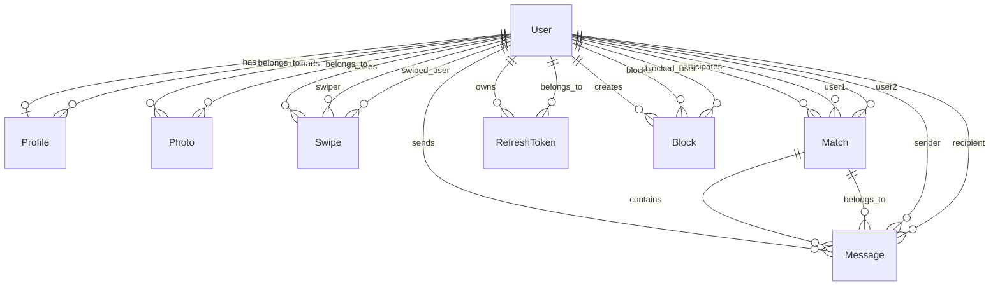

# Data Model: Tinder Clone Core

## Entity Definitions

### User (ASP.NET Identity)
**Purpose**: Core authentication entity
**Table**: `AspNetUsers`

| Field | Type | Constraints | Description |
|-------|------|-------------|-------------|
| Id | string (GUID) | PK, NOT NULL | Unique user identifier |
| UserName | string(256) | UNIQUE, NOT NULL | Same as email for this app |
| Email | string(256) | UNIQUE, NOT NULL | User's email address |
| EmailConfirmed | bool | NOT NULL, DEFAULT false | Email verification status |
| PasswordHash | string | NOT NULL | Hashed password |
| SecurityStamp | string | NULL | For invalidating tokens |
| ConcurrencyStamp | string | NULL | For optimistic concurrency |
| PhoneNumber | string | NULL | Optional phone number |
| PhoneNumberConfirmed | bool | NOT NULL, DEFAULT false | Phone verification status |
| TwoFactorEnabled | bool | NOT NULL, DEFAULT false | 2FA status |
| LockoutEnd | DateTimeOffset? | NULL | Account lockout expiry |
| LockoutEnabled | bool | NOT NULL, DEFAULT true | Can be locked out |
| AccessFailedCount | int | NOT NULL, DEFAULT 0 | Failed login attempts |
| CreatedAt | DateTime | NOT NULL, UTC | Account creation timestamp |
| LastLoginAt | DateTime? | NULL, UTC | Last successful login |
| IsDeleted | bool | NOT NULL, DEFAULT false | Soft delete flag |
| DeletedAt | DateTime? | NULL, UTC | Soft delete timestamp |

**Indexes**:
- UNIQUE INDEX on Email
- INDEX on IsDeleted
- INDEX on CreatedAt

### Profile
**Purpose**: User profile information and preferences
**Table**: `profiles`

| Field | Type | Constraints | Description |
|-------|------|-------------|-------------|
| Id | Guid | PK, NOT NULL | Profile identifier |
| UserId | string | FK, UNIQUE, NOT NULL | References User.Id |
| DisplayName | string(100) | NOT NULL | Display name |
| Bio | string(500) | NULL | Profile bio/description |
| BirthDate | DateTime | NOT NULL, UTC | Date of birth |
| Age | int | COMPUTED | Calculated from BirthDate |
| Gender | string(20) | NOT NULL | User's gender |
| SeekingGender | string(20) | NOT NULL | Preferred gender |
| Location | Point (PostGIS) | NOT NULL | Current location |
| LocationUpdatedAt | DateTime | NOT NULL, UTC | Last location update |
| City | string(100) | NULL | City name (geocoded) |
| Country | string(100) | NULL | Country name (geocoded) |
| MaxDistance | int | NOT NULL, DEFAULT 50 | Max distance in km |
| AgeRangeMin | int | NOT NULL, DEFAULT 18 | Minimum age preference |
| AgeRangeMax | int | NOT NULL, DEFAULT 100 | Maximum age preference |
| ShowMe | bool | NOT NULL, DEFAULT true | Appear in discovery |
| IsActive | bool | NOT NULL, DEFAULT true | Profile active status |
| CreatedAt | DateTime | NOT NULL, UTC | Profile creation |
| UpdatedAt | DateTime | NOT NULL, UTC | Last profile update |
| LastSeenAt | DateTime? | NULL, UTC | Last activity |

**Indexes**:
- UNIQUE INDEX on UserId
- SPATIAL INDEX (GIST) on Location
- INDEX on Gender, SeekingGender
- INDEX on IsActive, ShowMe
- INDEX on Age
- INDEX on LastSeenAt

**Constraints**:
- CHECK Age >= 18
- CHECK AgeRangeMin >= 18
- CHECK AgeRangeMax >= AgeRangeMin
- CHECK MaxDistance > 0 AND MaxDistance <= 500

### Photo
**Purpose**: User photos
**Table**: `photos`

| Field | Type | Constraints | Description |
|-------|------|-------------|-------------|
| Id | Guid | PK, NOT NULL | Photo identifier |
| UserId | string | FK, NOT NULL | References User.Id |
| Data | byte[] | NOT NULL | Photo binary data |
| ContentType | string(50) | NOT NULL | MIME type |
| SizeBytes | int | NOT NULL | File size in bytes |
| Width | int | NULL | Image width in pixels |
| Height | int | NULL | Image height in pixels |
| IsPrimary | bool | NOT NULL, DEFAULT false | Primary photo flag |
| OrderIndex | int | NOT NULL | Display order (0-5) |
| UploadedAt | DateTime | NOT NULL, UTC | Upload timestamp |
| IsDeleted | bool | NOT NULL, DEFAULT false | Soft delete flag |

**Indexes**:
- INDEX on UserId, IsDeleted
- INDEX on UserId, IsPrimary
- INDEX on UserId, OrderIndex

**Constraints**:
- CHECK SizeBytes <= 5242880 (5MB)
- CHECK ContentType IN ('image/jpeg', 'image/png')
- CHECK OrderIndex >= 0 AND OrderIndex <= 5
- UNIQUE (UserId, OrderIndex) WHERE IsDeleted = false

### Swipe
**Purpose**: Track user swipe actions
**Table**: `swipes`

| Field | Type | Constraints | Description |
|-------|------|-------------|-------------|
| Id | Guid | PK, NOT NULL | Swipe identifier |
| SwiperId | string | FK, NOT NULL | User who swiped |
| SwipedUserId | string | FK, NOT NULL | User who was swiped on |
| Direction | string(10) | NOT NULL | 'Like' or 'Pass' |
| SwipedAt | DateTime | NOT NULL, UTC | Swipe timestamp |
| IsSuperLike | bool | NOT NULL, DEFAULT false | Super like flag |

**Indexes**:
- UNIQUE INDEX on (SwiperId, SwipedUserId)
- INDEX on SwiperId, Direction
- INDEX on SwipedUserId, Direction
- INDEX on SwipedAt

**Constraints**:
- CHECK Direction IN ('Like', 'Pass')
- CHECK SwiperId != SwipedUserId

### Match
**Purpose**: Track mutual likes (matches)
**Table**: `matches`

| Field | Type | Constraints | Description |
|-------|------|-------------|-------------|
| Id | Guid | PK, NOT NULL | Match identifier |
| User1Id | string | FK, NOT NULL | First user |
| User2Id | string | FK, NOT NULL | Second user |
| MatchedAt | DateTime | NOT NULL, UTC | Match creation |
| IsActive | bool | NOT NULL, DEFAULT true | Match active status |
| UnmatchedAt | DateTime? | NULL, UTC | Unmatch timestamp |
| UnmatchedBy | string? | FK, NULL | Who unmatched |
| LastMessageAt | DateTime? | NULL, UTC | Last message time |
| MessageCount | int | NOT NULL, DEFAULT 0 | Total messages |

**Indexes**:
- UNIQUE INDEX on (User1Id, User2Id)
- INDEX on User1Id, IsActive
- INDEX on User2Id, IsActive
- INDEX on MatchedAt
- INDEX on LastMessageAt

**Constraints**:
- CHECK User1Id < User2Id (ensure consistent ordering)
- CHECK User1Id != User2Id

### Message
**Purpose**: Chat messages between matched users
**Table**: `messages`

| Field | Type | Constraints | Description |
|-------|------|-------------|-------------|
| Id | Guid | PK, NOT NULL | Message identifier |
| MatchId | Guid | FK, NOT NULL | References Match.Id |
| SenderId | string | FK, NOT NULL | Message sender |
| RecipientId | string | FK, NOT NULL | Message recipient |
| Content | string(1000) | NOT NULL | Message text |
| SentAt | DateTime | NOT NULL, UTC | Send timestamp |
| ReadAt | DateTime? | NULL, UTC | Read timestamp |
| IsDeleted | bool | NOT NULL, DEFAULT false | Soft delete flag |
| DeletedAt | DateTime? | NULL, UTC | Delete timestamp |

**Indexes**:
- INDEX on MatchId, SentAt
- INDEX on SenderId, SentAt
- INDEX on RecipientId, ReadAt
- INDEX on MatchId, IsDeleted

**Constraints**:
- CHECK SenderId != RecipientId
- CHECK Length(Content) > 0

### RefreshToken
**Purpose**: JWT refresh token storage
**Table**: `refresh_tokens`

| Field | Type | Constraints | Description |
|-------|------|-------------|-------------|
| Id | Guid | PK, NOT NULL | Token identifier |
| UserId | string | FK, NOT NULL | Token owner |
| Token | string(500) | UNIQUE, NOT NULL | Token value |
| FamilyId | string(100) | NOT NULL | Token family for rotation |
| ExpiresAt | DateTime | NOT NULL, UTC | Expiration time |
| CreatedAt | DateTime | NOT NULL, UTC | Creation time |
| CreatedByIp | string(45) | NULL | IP address |
| RevokedAt | DateTime? | NULL, UTC | Revocation time |
| RevokedByIp | string(45) | NULL | Revoking IP |
| ReplacedByToken | string(500) | NULL | Replacement token |
| IsActive | bool | COMPUTED | !RevokedAt && !Expired |

**Indexes**:
- UNIQUE INDEX on Token
- INDEX on UserId, IsActive
- INDEX on FamilyId
- INDEX on ExpiresAt

### Block (Future)
**Purpose**: User blocking functionality
**Table**: `blocks`

| Field | Type | Constraints | Description |
|-------|------|-------------|-------------|
| Id | Guid | PK, NOT NULL | Block identifier |
| BlockerId | string | FK, NOT NULL | User who blocked |
| BlockedUserId | string | FK, NOT NULL | User who was blocked |
| BlockedAt | DateTime | NOT NULL, UTC | Block timestamp |
| Reason | string(200) | NULL | Optional reason |

**Indexes**:
- UNIQUE INDEX on (BlockerId, BlockedUserId)
- INDEX on BlockedUserId

## Relationships



## State Transitions

### User States
```
Created -> EmailConfirmed -> Active
Active -> Locked (failed logins)
Locked -> Active (timeout or password reset)
Active -> Deleted (soft delete)
```

### Match States
```
Created (mutual like) -> Active
Active -> Inactive (unmatch)
```

### Message States
```
Sent -> Read
Sent -> Deleted (soft delete)
```

### Swipe Flow
```
No Swipe -> Pass (no further action)
No Swipe -> Like -> Check Reciprocal -> No Match
No Swipe -> Like -> Check Reciprocal -> Create Match
```

## Data Integrity Rules

1. **Cascading Deletes**:
   - User deletion (soft) cascades to Profile, Photos, Swipes, Matches, Messages
   - Hard deletes only for RefreshTokens

2. **Unique Constraints**:
   - One profile per user
   - One swipe per user pair
   - One match per user pair (normalized ordering)
   - Unique email per user

3. **Referential Integrity**:
   - All foreign keys must reference existing records
   - Orphaned records cleaned up by background job

4. **Business Rules**:
   - Users can only swipe on profiles matching their preferences
   - Messages only allowed between matched users
   - Photos limited to 6 per user
   - At least one photo required for discovery
   - Age must be 18+

5. **Consistency Rules**:
   - Match.User1Id always less than Match.User2Id (alphabetically)
   - Primary photo flag unique per user
   - Photo order indices must be sequential
   - Location updated triggers discovery feed refresh

## Performance Considerations

1. **Indexes**: All foreign keys and commonly queried fields indexed
2. **Spatial Index**: GIST index on Profile.Location for proximity queries
3. **Partitioning**: Consider partitioning Messages table by MatchId for scale
4. **Archival**: Old messages and inactive matches archived after 6 months
5. **Caching**: User profiles and photos cached in Redis (future)

## Migration Strategy

1. **Initial Migration**: Create all tables with constraints and indexes
2. **Seed Data**: Add test users with complete profiles
3. **Rollback Support**: All migrations must be reversible
4. **Zero-Downtime**: Future migrations must support online execution