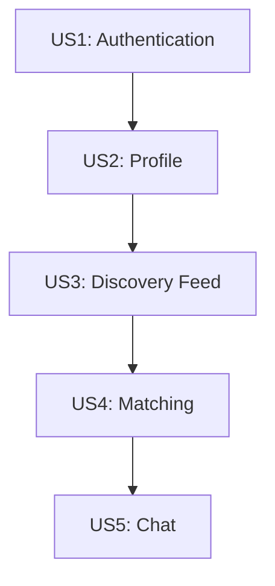

# Implementation Tasks: Tinder Clone Core

**Feature**: Complete dating application with profiles, matching, and chat
**Total Tasks**: 124
**Estimated Effort**: 2-3 weeks (1-2 developers)

## Overview

This document contains implementation tasks organized by user story phases. Each phase delivers independently testable functionality following the MVP approach.

## Phase Organization

- **Phase 1**: Project Setup & Infrastructure
- **Phase 2**: Foundational Components (blocking prerequisites)
- **Phase 3**: [US1] User Registration & Authentication
- **Phase 4**: [US2] Profile Creation & Management
- **Phase 5**: [US3] Discovery Feed & Swiping
- **Phase 6**: [US4] Matching System
- **Phase 7**: [US5] Real-time Chat
- **Phase 8**: Polish & Cross-cutting Concerns

## Task Format Guide

- `[ ]` - Checkbox for tracking completion
- `T###` - Sequential task ID
- `[P]` - Parallelizable task (can run concurrently)
- `[US#]` - User story identifier
- File paths are always included in task descriptions

---

## Phase 1: Project Setup & Infrastructure

**Goal**: Initialize project structure and core infrastructure
**Test**: Docker compose starts all services with one command

### Setup Tasks

- [X] T001 Create monorepo structure with backend/ and frontend/ directories per plan.md
- [X] T002 [P] Initialize backend .NET project in backend/App with .NET 9 SDK
- [X] T003 [P] Initialize frontend Expo project in frontend/ with Expo SDK 51
- [X] T004 Create docker-compose.yml with PostgreSQL, backend, and frontend services
- [X] T005 Create .env.example with all required environment variables
- [X] T006 [P] Configure PostgreSQL with PostGIS extension in docker-compose.yml
- [X] T007 [P] Create backend Dockerfile with multi-stage build in backend/Dockerfile
- [X] T008 [P] Create frontend Dockerfile for Expo web in frontend/Dockerfile
- [X] T009 Configure health checks for all services in docker-compose.yml
- [X] T010 Add wait-for scripts to ensure proper service startup order

### Backend Infrastructure

- [X] T011 Configure ASP.NET Core in backend/App/Program.cs with services and middleware
- [X] T012 [P] Add Entity Framework Core packages to backend/App/App.csproj
- [X] T013 [P] Add ASP.NET Identity packages to backend/App/App.csproj
- [X] T014 [P] Add SignalR packages to backend/App/App.csproj
- [X] T015 [P] Add JWT authentication packages to backend/App/App.csproj
- [X] T016 Configure Swagger/OpenAPI in backend/App/Program.cs
- [X] T017 Create appsettings.json with JWT, database, and CORS configuration
- [X] T018 Create appsettings.Development.json with development overrides
- [X] T019 Configure Serilog for structured logging in backend/App/Program.cs
- [X] T020 Create health check endpoint at /health in backend/App/Program.cs

### Frontend Infrastructure

- [X] T021 Install React Navigation packages in frontend/package.json
- [X] T022 [P] Install Zustand for state management in frontend/package.json
- [X] T023 [P] Install Axios for API calls in frontend/package.json
- [X] T024 [P] Install SignalR client in frontend/package.json
- [X] T025 [P] Install react-native-deck-swiper in frontend/package.json
- [X] T026 [P] Install AsyncStorage in frontend/package.json
- [X] T027 [P] Install expo-image-picker in frontend/package.json
- [X] T028 [P] Install expo-location in frontend/package.json
- [X] T029 Configure TypeScript with strict mode in frontend/tsconfig.json
- [X] T030 Create API configuration in frontend/src/config/api.ts with platform-specific URLs

---

## Phase 2: Foundational Components

**Goal**: Create shared components required by multiple user stories
**Test**: Database connects, migrations run, API responds

### Database Foundation

- [X] T031 Create AppDbContext in backend/App/Data/AppDbContext.cs with DbSets
- [X] T032 Configure ASP.NET Identity in backend/App/Data/AppDbContext.cs
- [X] T033 Install PostGIS extension configuration in backend/App/Data/AppDbContext.cs
- [X] T034 Create BaseEntity abstract class in backend/App/Domain/BaseEntity.cs
- [X] T035 Configure connection string in backend/App/Program.cs
- [X] T036 Create initial migration with dotnet ef migrations add InitialCreate
- [X] T037 Configure automatic migration on startup in backend/App/Program.cs

### Core DTOs

- [X] T038 [P] Create ErrorResponse DTO in backend/App/DTOs/Common/ErrorResponse.cs
- [X] T039 [P] Create PaginatedResponse DTO in backend/App/DTOs/Common/PaginatedResponse.cs
- [X] T040 [P] Create ApiResponse wrapper in backend/App/DTOs/Common/ApiResponse.cs

### Frontend Foundation

- [X] T041 [P] Create TypeScript interfaces in frontend/src/types/index.ts
- [X] T042 [P] Create axios instance with interceptors in frontend/src/config/api.ts
- [X] T043 [P] Create error handling utilities in frontend/src/utils/errorHandler.ts
- [X] T044 Create root navigation container in frontend/src/navigation/AppNavigator.tsx
- [X] T045 Create app entry point in frontend/App.tsx

---

## Phase 3: [US1] User Registration & Authentication

**Goal**: Users can register, login, and maintain sessions
**Test**: Register new user, login, refresh token, logout

### Backend - User Entity & Auth

- [X] T046 [US1] Extend IdentityUser with custom fields in backend/App/Domain/User.cs
- [X] T047 [US1] Create RefreshToken entity in backend/App/Domain/RefreshToken.cs
- [X] T048 [US1] Create RegisterRequest DTO in backend/App/DTOs/Auth/RegisterRequest.cs
- [X] T049 [US1] Create LoginRequest DTO in backend/App/DTOs/Auth/LoginRequest.cs
- [X] T050 [US1] Create AuthResponse DTO in backend/App/DTOs/Auth/AuthResponse.cs
- [X] T051 [US1] Create RefreshTokenRequest DTO in backend/App/DTOs/Auth/RefreshTokenRequest.cs
- [X] T052 [US1] Create UserDto in backend/App/DTOs/Auth/UserDto.cs
- [X] T053 [US1] Implement AuthService in backend/App/Services/AuthService.cs
- [X] T054 [US1] Implement JWT token generation in AuthService
- [X] T055 [US1] Implement refresh token rotation in AuthService
- [X] T056 [US1] Create AuthController in backend/App/Controllers/AuthController.cs
- [X] T057 [US1] Implement POST /api/auth/register endpoint
- [X] T058 [US1] Implement POST /api/auth/login endpoint
- [X] T059 [US1] Implement POST /api/auth/refresh endpoint
- [X] T060 [US1] Implement POST /api/auth/logout endpoint
- [X] T061 [US1] Add JWT middleware configuration in backend/App/Program.cs
- [X] T062 [US1] Create auth migration with dotnet ef migrations add AddAuthentication

### Frontend - Auth Screens & Store

- [X] T063 [P] [US1] Create auth store in frontend/src/store/authStore.ts
- [X] T064 [P] [US1] Create auth service in frontend/src/services/authService.ts
- [X] T065 [US1] Create LoginScreen in frontend/src/screens/auth/LoginScreen.tsx
- [X] T066 [US1] Create RegisterScreen in frontend/src/screens/auth/RegisterScreen.tsx
- [X] T067 [US1] Add auth navigation stack in frontend/src/navigation/AppNavigator.tsx
- [X] T068 [US1] Implement token storage in AsyncStorage
- [X] T069 [US1] Implement auto token refresh in axios interceptors
- [X] T070 [US1] Add auth state persistence across app restarts

---

## Phase 4: [US2] Profile Creation & Management

**Goal**: Users can create profiles with photos and preferences
**Test**: Create profile, upload photos, edit preferences

### Backend - Profile & Photo Entities

- [X] T071 [US2] Create Profile entity in backend/App/Domain/Profile.cs
- [X] T072 [US2] Create Photo entity in backend/App/Domain/Photo.cs
- [X] T073 [US2] Configure PostGIS Point type for Location in Profile entity
- [X] T074 [US2] Create ProfileDto in backend/App/DTOs/Profile/ProfileDto.cs
- [X] T075 [US2] Create UpdateProfileRequest in backend/App/DTOs/Profile/UpdateProfileRequest.cs
- [X] T076 [US2] Create PhotoDto in backend/App/DTOs/Profile/PhotoDto.cs
- [X] T077 [US2] Create UpdateLocationRequest in backend/App/DTOs/Profile/UpdateLocationRequest.cs
- [X] T078 [US2] Implement ProfileService in backend/App/Services/ProfileService.cs
- [X] T079 [US2] Implement PhotoService in backend/App/Services/PhotoService.cs
- [X] T080 [US2] Create ProfileController in backend/App/Controllers/ProfileController.cs
- [X] T081 [US2] Implement GET /api/profile endpoint
- [X] T082 [US2] Implement PUT /api/profile endpoint
- [X] T083 [US2] Implement PUT /api/profile/location endpoint
- [X] T084 [US2] Implement POST /api/profile/photos endpoint
- [X] T085 [US2] Implement DELETE /api/profile/photos/{id} endpoint
- [X] T086 [US2] Implement PUT /api/profile/photos/{id}/primary endpoint
- [X] T087 [US2] Create profile migration with dotnet ef migrations add AddProfiles

### Frontend - Profile Screens

- [X] T088 [P] [US2] Create profile store in frontend/src/store/profileStore.ts
- [X] T089 [P] [US2] Create profile service in frontend/src/services/profileService.ts
- [X] T090 [US2] Create ProfileScreen in frontend/src/screens/profile/ProfileScreen.tsx
- [X] T091 [US2] Create EditProfileScreen in frontend/src/screens/profile/EditProfileScreen.tsx
- [X] T092 [US2] Create PhotoGallery component in frontend/src/components/PhotoGallery.tsx
- [X] T093 [US2] Implement photo upload with expo-image-picker
- [X] T094 [US2] Implement location update with expo-location
- [X] T095 [US2] Add profile tab to bottom navigation

---

## Phase 5: [US3] Discovery Feed & Swiping

**Goal**: Users can browse and swipe on potential matches
**Test**: Load feed, swipe left/right, feed updates

### Backend - Feed & Swipe

- [X] T096 [US3] Create Swipe entity in backend/App/Domain/Swipe.cs
- [X] T097 [US3] Create FeedProfile DTO in backend/App/DTOs/Feed/FeedProfile.cs
- [X] T098 [US3] Create SwipeRequest DTO in backend/App/DTOs/Swipe/SwipeRequest.cs
- [X] T099 [US3] Create SwipeResponse DTO in backend/App/DTOs/Swipe/SwipeResponse.cs
- [X] T100 [US3] Implement FeedService with PostGIS queries in backend/App/Services/FeedService.cs
- [X] T101 [US3] Implement SwipeService in backend/App/Services/SwipeService.cs
- [X] T102 [US3] Create FeedController in backend/App/Controllers/FeedController.cs
- [X] T103 [US3] Implement GET /api/feed endpoint with spatial queries
- [X] T104 [US3] Create SwipeController in backend/App/Controllers/SwipeController.cs
- [X] T105 [US3] Implement POST /api/swipes endpoint
- [X] T106 [US3] Create swipe migration with dotnet ef migrations add AddSwipes

### Frontend - Feed Screen

- [X] T107 [P] [US3] Create feed store in frontend/src/store/feedStore.ts
- [X] T108 [P] [US3] Create feed service in frontend/src/services/feedService.ts
- [X] T109 [P] [US3] Create swipe service in frontend/src/services/swipeService.ts
- [X] T110 [US3] Create FeedScreen in frontend/src/screens/feed/FeedScreen.tsx
- [X] T111 [US3] Create SwipeCard component in frontend/src/components/SwipeCard.tsx
- [X] T112 [US3] Integrate react-native-deck-swiper for swipe gestures
- [X] T113 [US3] Implement optimistic UI updates for swipes
- [X] T114 [US3] Add feed tab to bottom navigation

---

## Phase 6: [US4] Matching System

**Goal**: Create matches on mutual likes and display match list
**Test**: Mutual like creates match, view matches, unmatch

### Backend - Matching

- [X] T115 [US4] Create Match entity in backend/App/Domain/Match.cs
- [X] T116 [US4] Create MatchDto in backend/App/DTOs/Match/MatchDto.cs
- [X] T117 [US4] Implement MatchService in backend/App/Services/MatchService.cs
- [X] T118 [US4] Update SwipeService to check for matches on likes
- [X] T119 [US4] Create MatchController in backend/App/Controllers/MatchController.cs
- [X] T120 [US4] Implement GET /api/matches endpoint
- [X] T121 [US4] Implement POST /api/matches/{id}/unmatch endpoint
- [X] T122 [US4] Create match migration with dotnet ef migrations add AddMatches

### Frontend - Matches Screen

- [X] T123 [P] [US4] Create match store in frontend/src/store/matchStore.ts
- [X] T124 [P] [US4] Create match service in frontend/src/services/matchService.ts
- [X] T125 [US4] Create MatchesScreen in frontend/src/screens/matches/MatchesScreen.tsx
- [X] T126 [US4] Create match notification component
- [X] T127 [US4] Add matches tab to bottom navigation

---

## Phase 7: [US5] Real-time Chat

**Goal**: Matched users can chat with real-time messaging
**Test**: Send messages, receive in real-time, typing indicators

### Backend - Messaging & SignalR

- [X] T128 [US5] Create Message entity in backend/App/Domain/Message.cs
- [X] T129 [US5] Create MessageDto in backend/App/DTOs/Message/MessageDto.cs
- [X] T130 [US5] Create SendMessageRequest in backend/App/DTOs/Message/SendMessageRequest.cs
- [X] T131 [US5] Implement MessageService in backend/App/Services/MessageService.cs
- [X] T132 [US5] Create ChatHub SignalR hub in backend/App/Hubs/ChatHub.cs
- [X] T133 [US5] Implement SendMessage method in ChatHub
- [X] T134 [US5] Implement typing indicators in ChatHub
- [X] T135 [US5] Implement read receipts in ChatHub
- [X] T136 [US5] Create MessageController in backend/App/Controllers/MessageController.cs
- [X] T137 [US5] Implement GET /api/messages/{matchId} endpoint
- [X] T138 [US5] Implement POST /api/messages endpoint
- [X] T139 [US5] Configure SignalR authentication in backend/App/Program.cs
- [X] T140 [US5] Create message migration with dotnet ef migrations add AddMessages

### Frontend - Chat Screens

- [X] T141 [P] [US5] Create chat store in frontend/src/store/chatStore.ts
- [X] T142 [P] [US5] Create message service in frontend/src/services/messageService.ts
- [X] T143 [P] [US5] Create SignalR service in frontend/src/services/signalrService.ts
- [X] T144 [US5] Create ChatListScreen in frontend/src/screens/chat/ChatListScreen.tsx
- [X] T145 [US5] Create ChatScreen in frontend/src/screens/chat/ChatScreen.tsx
- [X] T146 [US5] Create MessageBubble component in frontend/src/components/MessageBubble.tsx
- [X] T147 [US5] Implement real-time message updates via SignalR
- [X] T148 [US5] Implement typing indicators
- [X] T149 [US5] Implement read receipts
- [ ] T150 [US5] Add message persistence in offline mode

---

## Phase 8: Polish & Cross-cutting Concerns

**Goal**: Production readiness and quality improvements
**Test**: All features work smoothly, error handling, performance

### Backend Polish

- [X] T151 Add input validation attributes to all DTOs
- [X] T152 Implement global exception handler middleware
- [ ] T153 Add rate limiting to authentication endpoints
- [ ] T154 Add request/response logging middleware
- [X] T155 Create database indexes for all foreign keys
- [X] T156 Add database seed data for testing
- [X] T157 Optimize PostGIS queries with proper indexes

### Frontend Polish

- [X] T158 [P] Add loading states to all screens
- [ ] T159 [P] Add error boundaries for graceful failures
- [X] T160 [P] Implement pull-to-refresh where appropriate
- [X] T161 [P] Add empty state designs
- [ ] T162 Add app icon and splash screen
- [ ] T163 Implement deep linking support
- [ ] T164 Add offline mode indicators

### Testing & Documentation

- [X] T165 Create API documentation in Swagger
- [X] T166 Create README.md with setup instructions
- [X] T167 Add example .env file with all variables
- [ ] T168 Create docker-compose.prod.yml for production

---

## Dependencies

### User Story Dependencies

### Parallel Execution Opportunities

#### Phase 1 (Setup)
- Backend and Frontend initialization can run in parallel (T002, T003)
- Package installations can run in parallel (T021-T028)
- Docker configurations can be created in parallel (T007, T008)

#### Phase 3 (US1: Auth)
- Frontend and backend auth components can develop in parallel after entities are created
- DTOs can be created in parallel (T048-T052)

#### Phase 4 (US2: Profile)
- Frontend and backend profile features can develop in parallel
- Store and service creation can be parallel (T088, T089)

#### Phase 5 (US3: Feed)
- Frontend components can be built while backend endpoints are developed
- Services can be implemented in parallel (T107-T109)

#### Phase 8 (Polish)
- All polish tasks can run in parallel as they're independent

---

## Implementation Strategy

### MVP Approach
1. **First Deliverable**: Complete Phase 1-3 for basic auth functionality
2. **Second Deliverable**: Add Phase 4 for profile management
3. **Third Deliverable**: Add Phase 5-6 for core matching feature
4. **Final Deliverable**: Add Phase 7 for chat functionality

### Testing Strategy
- Each phase should be independently testable
- Manual testing via Swagger UI for backend
- Manual testing via Expo Go for frontend
- Integration testing after each phase completion

### Rollback Points
- After each migration, test rollback capability
- Keep database backups after each phase
- Tag git commits at phase completion

---

## Notes

- All tasks include specific file paths for implementation
- Tasks marked [P] can be executed in parallel
- User story labels [US#] track feature ownership
- Each phase delivers working functionality
- Dependencies are minimized for parallel execution